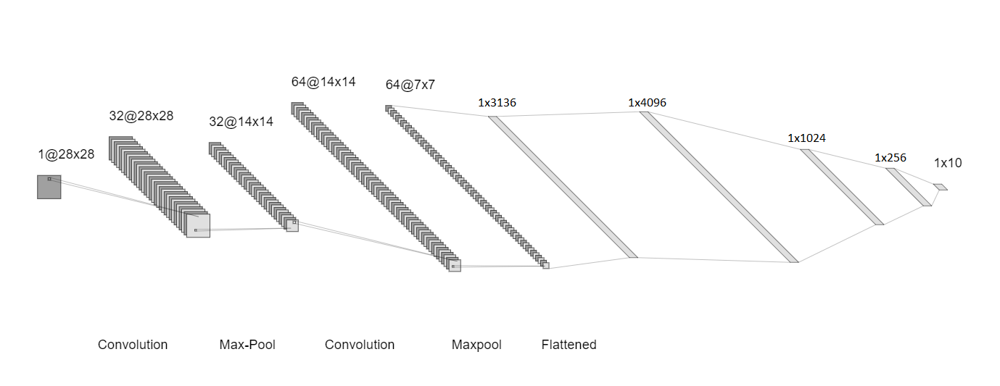
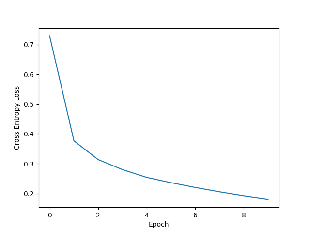

# Classification on fashion-MNIST database using VGGnet-like architecture

## Purpose
We want to classify the pictures of fashion MNIST database at least with 85 % accuracy. Fashion-MNIST is a dataset of [Zalando](https://jobs.zalando.com/en/tech/?gh_src=22377bdd1us)'s article images—consisting of a training set of 60,000 examples and a test set of 10,000 examples. Each example is a 28x28 grayscale image, associated with a label from 10 classes.

## System architecture
We want to implement a VGGnet-like architecture using PyTorch machine learning framework (see on figure below). It contains twa major parts: a convolutional network to gain the features from the images, and a fully connected network to classify the input:

Features:
- 2D convolutional layer: Input channels: 1, Output channels 32, Kernel size: 3x3, Stride: 1x1, Padding: 1x1
- 2D Batch normalization
- ReLu
- 2D Max pooling: Kernel size: 2x2, Stride: 2, Padding: 0
- 2D convolutional layer: Input channels: 32, Output channels 64, Kernel size: 3x3, Stride: 1x1, Padding: 1x1
- 2D Batch normalization
- ReLu
- 2D Max pooling: Kernel size: 2x2, Stride: 2, Padding: 0

Classifier:
- Linear: In features: 3136, Out features: 4096
- ReLU
- Linear: In features: 4096, Out features: 1024
- ReLU
- Dropout
- ReLU
- Linear: In features: 1024, Out features: 256
- ReLU
- Linear: In features: 256, Out features: 10

To optimize the model we use the built in cross entropy loss function and Adam optimizer in PyTorch.

## Code
The project contains two python files, the train.py, and utils.py which contains self defined functions that are used by the train.py file.  Run the train.py file to get the results.
Ide majd lépésenként le kéne írni, hogy nagy vonalakban mit csinál a kód

## Results
We train the network for 10 epochs, and could reach 90.22 % accuracy on test dataset.

## Requirements
The code was tested with PyTorch 1.11.0, Python 3.9.9, CUDA 11.3, and up-to-date versions of a few other standard packages, older versions might not work out-of-the-box. It can run on both CPU and GPU (Nvidia), but GPU operation is preferred, CPU is much slower and not tested. GPU requirements are the same as required by PyTorch.

## Contribution of group members
Benjámin Kispál: Implementation of the network, and the optimization part. Levente Maucha: load and preprocess the data and other functions. But we mainly work together, and discuss the upcoming problems.

## References
[https://pytorch.org/](https://pytorch.org/)
